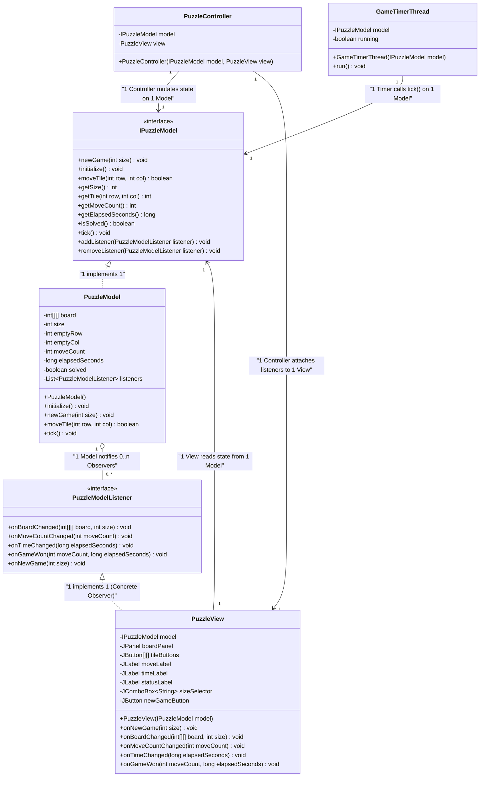
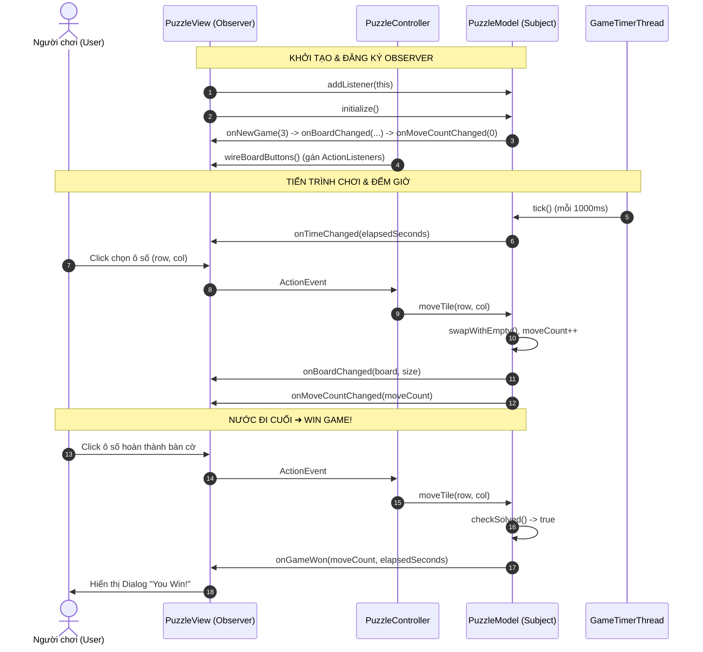

# 🧩 Number Puzzle Game (Java Swing - MVC & Observer Pattern)

Ứng dụng trò chơi **Xếp Số (N-Puzzle Game / Sliding Puzzle)** được xây dựng bằng ngôn ngữ **Java Swing**, áp dụng nghiêm ngặt kiến trúc **MVC (Model-View-Controller)** kết hợp với mẫu thiết kế **Observer Design Pattern** và lập trình **Đa luồng (Multithreading)**.

---

## 🌟 Tính Năng Chính (Features)

- 🎮 **Bàn cờ linh hoạt**: Hỗ trợ chơi bàn cờ kích thước **3x3** (8-puzzle) và **4x4** (15-puzzle).
- 🔀 **Xáo trộn thông minh (Solvable Shuffle)**: Xáo trộn ngẫu nhiên dựa trên các bước di chuyển hợp lệ từ bàn cờ đã giải, đảm bảo bàn cờ tạo ra **luôn luôn giải được**.
- 📊 **Theo dõi chỉ số Real-time**:
  - Đếm tổng số nước đi (Move Counter).
  - Đếm thời gian chơi theo giây (Elapsed Timer) chạy ngầm bằng `Thread`.
- 🏆 **Tự động nhận diện chiến thắng**: Khi người chơi di chuyển ô số cuối cùng về đúng vị trí (1 -> $N^2-1$), hệ thống sẽ dừng đồng hồ, thông báo chiến thắng và ghi nhận thành tích.
- 🎨 **Giao diện trực quan**: Giao diện Swing phản hồi nhanh chóng, hỗ trợ thay đổi kích thước bàn cờ và tạo ván mới bất kỳ lúc nào.

---

## 🏗️ Kiến Trúc Hệ Thống (Architecture & Design Patterns)

Dự án áp dụng mô hình thiết kế **MVC** và **Observer Pattern** giúp tách biệt hoàn toàn giữa dữ liệu nghiệp vụ và giao diện người dùng:

### 1. Model (`model/`)
- `IPuzzleModel`: Interface khai báo các chức năng của Model.
- `PuzzleModel`: Lớp quản lý trạng thái bàn cờ `board`, vị trí ô trống, số nước đi, thời gian và logic kiểm tra ô hợp lệ.
- **Đặc điểm**: Hoàn toàn **độc lập với UI** (không chứa thư viện Swing/AWT).

### 2. View (`view/`)
- `PuzzleView`: Kế thừa `JFrame`, hiển thị các thành phần Swing (`JButton`, `JLabel`, `JComboBox`).
- Triển khai `PuzzleModelListener` (**Concrete Observer**): Tự động lắng nghe và cập nhật giao diện khi Model thay đổi dữ liệu mà không cần can thiệp logic.

### 3. Controller (`controller/`)
- `PuzzleController`: Đón nhận các sự kiện thao tác của người dùng từ `PuzzleView` (click ô số, click "New Game") và gọi phương thức xử lý tương ứng trên `IPuzzleModel`.
- `GameTimerThread`: Kế thừa `Thread`, chạy ngầm định kỳ 1 giây và gọi `model.tick()` thông qua `SwingUtilities.invokeLater` để đảm bảo an toàn luồng (Thread-safety) trên EDT của Swing.

### 4. Observer (`observer/`)
- `PuzzleModelListener`: Interface định nghĩa các hàm callback sự kiện (`onBoardChanged`, `onMoveCountChanged`, `onTimeChanged`, `onGameWon`, `onNewGame`).

---

## 📁 Cấu Trúc Mã Nguồn (Project Structure)

```text
Number_Puzzle_Game/
├── src/
│   ├── controller/
│   │   ├── GameTimerThread.java      # Thread đếm thời gian ngầm
│   │   └── PuzzleController.java     # Controller kết nối View và Model
│   ├── model/
│   │   ├── IPuzzleModel.java         # Interface hợp đồng của Model
│   │   └── PuzzleModel.java          # Model xử lý logic game & Subject của Observer
│   ├── observer/
│   │   └── PuzzleModelListener.java  # Observer Interface nhận thông báo sự kiện
│   ├── view/
│   │   └── PuzzleView.java           # Swing View & Concrete Observer
│   └── Main.java                     # Entry point khởi chạy ứng dụng
├── .gitignore
├── Number_Puzzle_Game.iml
└── README.md
```

---

## 📊 Sơ Đồ UML (UML Diagrams)

### Class Diagram



---

### Sequence Diagram (Luồng tương tác các Entity)



---

## 🚀 Hướng Dẫn Biên Dịch & Khởi Chạy (Getting Started)

### Yêu cầu hệ thống:
- **Java Development Kit (JDK)**: Phiên bản 11 trở lên.

### Biên dịch & Chạy từ dòng lệnh (Command Line):

1. **Truy cập thư mục dự án**:
   ```bash
   cd Number_Puzzle_Game
   ```

2. **Biên dịch mã nguồn Java**:
   ```bash
   javac -d bin src/observer/*.java src/model/*.java src/view/*.java src/controller/*.java src/Main.java
   ```

3. **Khởi chạy ứng dụng**:
   ```bash
   java -cp bin Main
   ```

### Chạy bằng IDE (IntelliJ IDEA / Eclipse / NetBeans):
1. Mở IDE và chọn **Open / Import Project**.
2. Trỏ tới thư mục `Number_Puzzle_Game`.
3. Mở file `src/Main.java` và chọn **Run Main.main()**.

---

## 📝 Giấy Phép & Tác Giả (License & Author)

- **Dự án**: SWD392 / PRN232 Final Project
- **Ngôn ngữ**: Java (Swing GUI)
- **Kiến trúc**: MVC + Observer Pattern
